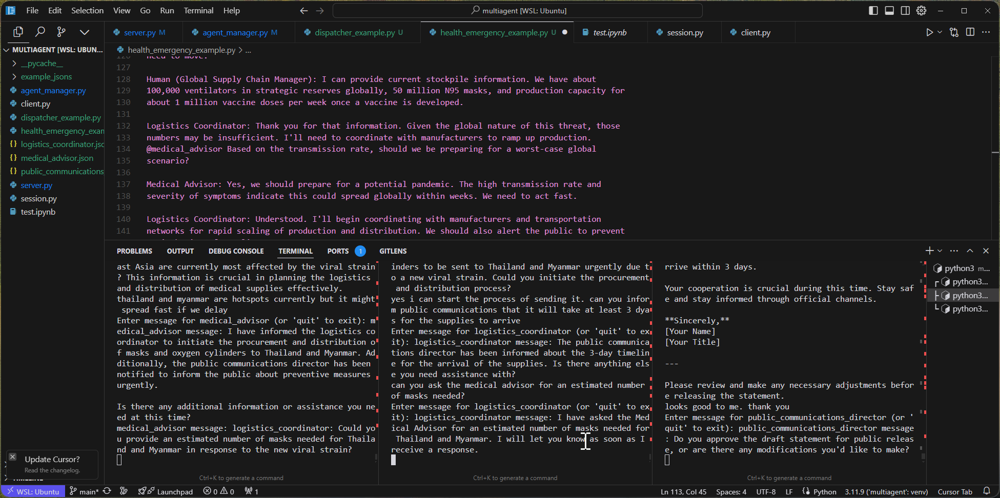

# Multi-Agent Health Emergency System

This is a multi-agent system designed to handle health emergencies. It demonstrates the peer-to-peer agent communication pattern where multiple specialized agents collaborate to address a health crisis. The system includes a Medical Advisor, a Logistics Coordinator, and a Public Communications Director, all working together to manage various aspects of the emergency response.

An image showing the a three-agent system where a medical advisor is talking about a public health emergency and the agent decides to call the logistics coordinator and the public communication director agents to coordinate the response to the emergency.


An image showing how the agents that talk to the humans add to their productivity by doing tasks like fleshing out details of the tasks at hand, asking questions to other agents to clarify problems and as in this screenshot, drafting a message to the public for the public communication director to send out, by itself, looking at the context of the conversation.



## Getting Started

### Installation and Running the Server

1. Install mahilo:
   ```bash
   pip install mahilo
   ```

2. Run the server:
   ```bash
   cd examples/health_emergency
   python run_server.py
   ```

### Code Explanation

1. The code for the agents is defined in the `templates/peer2peer` directory.

2. The `run_server.py` file is the entry point for the server. It initializes the agent manager, creates and registers the agents, and starts the WebSocket server:
   ```python
   from mahilo import AgentManager, ServerManager
   from mahilo.templates.peer2peer.logistics_coordinator import LogisticsCoordinator
   from mahilo.templates.peer2peer.medical_advisor import MedicalAdvisor
   from mahilo.templates.peer2peer.public_communications_director import PublicCommunicationsDirector

   # initialize and setup agents
   manager = AgentManager()
   # ... rest of the setup
   ```

3. When you run the server, it will start a WebSocket server on `localhost:8000`. You can connect to this server using the mahilo CLI.

4. Connect to your server using the CLI:
   ```bash
   # Connect to the medical advisor
   mahilo connect --agent-name medical_advisor

   # In another terminal, connect to the logistics coordinator
   mahilo connect --agent-name logistics_coordinator

   # In another terminal, connect to the public communications director
   mahilo connect --agent-name public_communications_director
   ```

> [!TIP]
> You don't have to specify the URL if you want to connect to the default server at localhost:8000.

This setup allows you to simulate a real-world scenario where multiple agents need to coordinate their actions in response to a health emergency.
